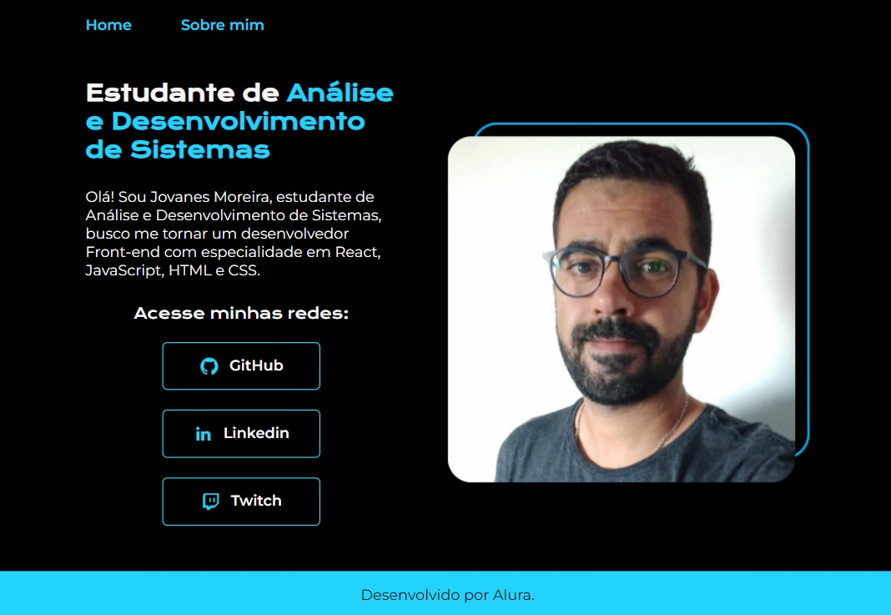

<h1 align="center">Portfólio </h1>

<a href="#-tecnologias">Tecnologias</a>&nbsp;&nbsp;&nbsp; | &nbsp;&nbsp;&nbsp;
<a href="#-projeto">Projeto</a> &nbsp;&nbsp;&nbsp; | &nbsp;&nbsp;&nbsp;
<a href="#-memo-licença">Licença</a>

 

## 🚀 Tecnologias

Esse projeto foi desenvolvido com as seguintes tecnologias:

- HTML
- CSS
- Git e Github

## 💻 Projeto

Meu primeiro portfólio desenvolvido com os cursos de HTML e CSS da Alura

## Licença

Esse projeto está sob a licença MIT.

## ✉️ Contato

junior_tmcb1@hotmail.com
